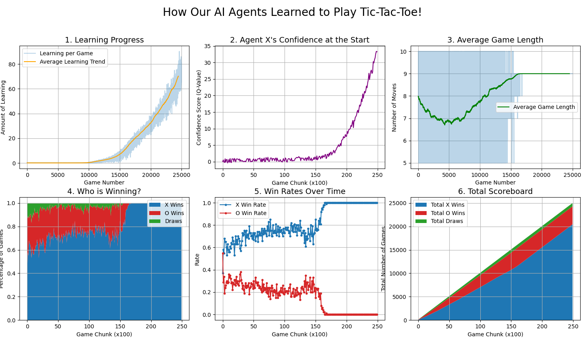
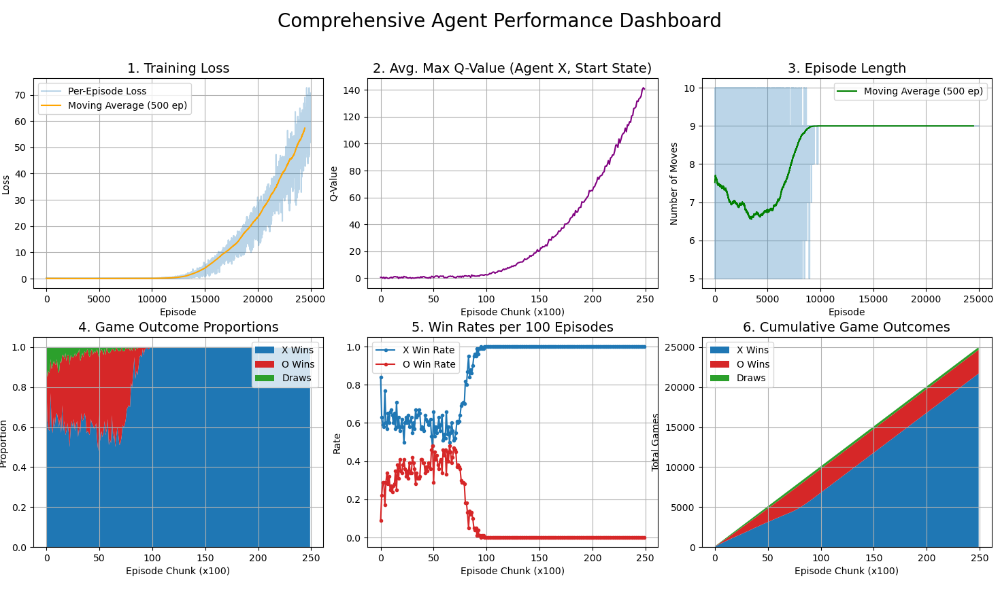

# Tic-Tac-Toe AI — Double Dueling DQN

Reinforcement-learning agents that learn Tic-Tac-Toe **from scratch by self-play**, built for a
Foundations of AI course project. The flagship model combines the full modern DQN toolkit —
Double DQN, Dueling architecture, NoisyNet exploration, and Prioritized Experience Replay —
plus a hand-playable **unbeatable minimax** opponent for comparison, in Python *and* C.

## Training dashboard (25,000 episodes of self-play)

<p align="center">
  
</p>
<p align="center">
  
</p>

## What's inside

| File | What it is |
|---|---|
| `fai.py` | **Flagship (855 lines):** Double Dueling DQN with NoisyNet layers, Prioritized Experience Replay (proportional sampling + importance-sampling weights), AdamW(amsgrad), Huber loss, soft target updates (τ=0.005), legal-move masking — two agents (X and O) train by self-play with terminal ±1 rewards; renders a 6-panel matplotlib dashboard |
| `1.py` | Friendlier-commented rewrite of the same architecture, dashboard titled for presentation |
| `7.py` | **Unbeatable minimax with alpha-beta pruning** in a tkinter GUI — play against a perfect opponent |
| `fai_2/main.c` | The minimax AI rewritten in **C with raylib** for a graphical board |

## The RL stack, briefly

- **Double DQN** — the policy net picks the action, the target net evaluates it (kills the
  overestimation bias of vanilla DQN)
- **Dueling** — separate value (V) and advantage (A) streams share one encoder
- **NoisyNet** — learnable exploration noise replaces epsilon-greedy
- **PER** — replay transitions sampled ∝ TD-error, corrected by importance-sampling weights

## Run

```bash
pip install -r requirements.txt          # torch, numpy, matplotlib

python FAI_proj_S3/fai.py                # train via self-play + live dashboard
python FAI_proj_S3/7.py                  # play vs. unbeatable minimax (tkinter)

# C + raylib version of the minimax game
cc -o fai_2/tictactoe fai_2/main.c -lraylib && ./fai_2/tictactoe
```

CUDA is used automatically when available; otherwise CPU.
